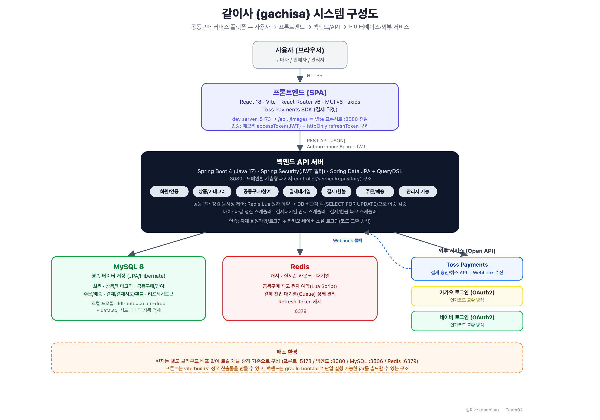

# 같이사 (gachisa)

**공동구매(Group-buy) 커머스 플랫폼** — 여러 구매자가 모여 목표 인원을 채우면 할인가로 상품을 구매하는 서비스입니다.
`gachisa-backend`(Spring Boot) + `gachisa-frontend`(React/Vite) 로 구성된 모노레포입니다.

## 목차

- [주요 기능](#주요-기능)
- [시스템 구성도](#시스템-구성도)
- [기술 스택](#기술-스택)
- [프로젝트 구조](#프로젝트-구조)
- [실행 방법](#실행-방법)
- [참고 사항](#참고-사항)

## 주요 기능

**구매자**
- 로그인 없이 공동구매/상품 목록 둘러보기, 참여 시점에만 로그인 요구
- 카테고리(트리 구조)·키워드·가격 조건으로 공동구매 검색, 마감임박순/가격순 정렬
- 공동구매 참여 → Toss Payments 결제 → 목표 인원 미달 시 자동 환불
- 결제 전 대기열(Queue) 진입으로 순간 트래픽 제어
- 내 참여내역/주문내역/배송조회, 카카오·네이버 소셜 로그인

**판매자**
- 상품 등록/수정/판매중지·재개, 내 상품 검색·관리 페이지
- 공동구매 등록(목표 인원/할인율/모집 기간 설정), 마감 전 취소

**관리자**
- 카테고리 트리 관리(추가/수정/삭제), 배송 상태 관리
- 진행중인 공동구매 강제 취소
- (로컬 전용) 공동구매 정원 동시성 제어 방식 비교 데모 (`/dev/concurrency`)

## 시스템 구성도



- **사용자 → 프론트엔드**: HTTPS로 SPA 접속
- **프론트엔드 → 백엔드**: `/api/**` REST 호출, `Authorization: Bearer {JWT}` + httpOnly 리프레시 쿠키
- **백엔드 → MySQL**: 회원/상품/공동구매/주문/결제 등 영속 데이터
- **백엔드 → Redis**: 공동구매 재고 원자 예약(Lua Script), 결제 대기열, 리프레시 토큰 캐시
- **백엔드 → 외부 서비스**: Toss Payments(결제 승인/취소 + Webhook 수신), 카카오/네이버 OAuth2 로그인

## 기술 스택

| 영역 | 스택 |
|---|---|
| Frontend | React 18, Vite, React Router v6, MUI v5, axios, Toss Payments SDK |
| Backend | Spring Boot 4 (Java 17), Spring Security(JWT), Spring Data JPA + QueryDSL, Spring Data Redis |
| Database | MySQL 8 |
| Cache / 실시간 처리 | Redis (재고 원자 예약 Lua Script, 결제 대기열, 리프레시 토큰 캐시) |
| 외부 연동 | Toss Payments(결제), Kakao/Naver OAuth2(소셜 로그인) |
| 인증 | JWT accessToken(메모리) + httpOnly refreshToken 쿠키, 자체 로그인 + 소셜 로그인 |

## 프로젝트 구조

```
NBE11-13-2-Team02/
├── gachisa-backend/    # Spring Boot API 서버
│   └── src/main/java/com/gachisa/
│       ├── user/           # 회원
│       ├── auth/           # 인증(JWT), 소셜 로그인(Kakao/Naver)
│       ├── product/        # 상품
│       ├── category/       # 카테고리(트리)
│       ├── groupbuy/       # 공동구매, 참여 동시성 제어
│       ├── participation/  # 참여
│       ├── queue/          # 결제 대기열(Redis)
│       ├── payment/        # 결제/환불(Toss), Webhook
│       ├── order/          # 주문/배송
│       ├── concurrency/    # (local 전용) 동시성 검증 데모
│       └── global/         # 공통 설정(Security, 예외 처리 등)
├── gachisa-frontend/   # React SPA
│   └── src/
│       ├── api/             # axios 기반 API 클라이언트
│       ├── pages/           # 라우트별 페이지
│       ├── components/      # 공통 컴포넌트
│       ├── context/         # 인증 컨텍스트
│       └── routes/          # 라우팅 + 역할별 접근 제어
├── setup.sh            # 로컬 개발 환경 초기 설정 스크립트
└── system-architecture.png
```

## 실행 방법

### 0. 사전 준비 (MySQL, Redis)

로컬에 MySQL 8 / Redis를 설치하고 아래 계정/DB를 만들어주세요.

- MySQL: `localhost:3306`, DB `gachisa`, 계정 `gachisa` / `gachisa1234`
- Redis: `localhost:6379`

### 1. 설정 파일 생성 + 프론트 의존성 설치

```bash
./setup.sh
```

`application-local.yml`(백엔드), `.env`(프론트) 설정 파일을 예제에서 복사해 만들고, `npm install`까지 자동으로 실행합니다. 둘 다 `.gitignore`에 등록되어 있어 각자 로컬에만 존재합니다.

- 백엔드: 필요하면 `application-local.yml`의 `jwt.secret` 값을 바꿔주세요.
- 프론트: 결제(Toss) 테스트를 하려면 `VITE_TOSS_CLIENT_KEY`를, 소셜 로그인 테스트를 하려면 `VITE_KAKAO_CLIENT_ID`/`VITE_NAVER_CLIENT_ID`를 채워야 합니다.

수동으로 하려면:

```bash
cp gachisa-backend/src/main/resources/application-local.yml.example gachisa-backend/src/main/resources/application-local.yml
cp gachisa-frontend/.env.example gachisa-frontend/.env
cd gachisa-frontend && npm install
```

### 2. 백엔드 실행

```bash
cd gachisa-backend
./gradlew bootRun
```

`http://localhost:8080` 에서 뜹니다. 기본 프로필은 `local`(`application.yml`에 명시)이라 별도 옵션 없이 실행해도 `application-local.yml` 설정으로 뜹니다.

결제·소셜 로그인까지 테스트하려면 실행 전에 환경변수를 넘겨주세요:

```bash
export TOSS_SECRET_KEY=test_sk_...
export KAKAO_CLIENT_ID=...
export KAKAO_CLIENT_SECRET=...   # 카카오 콘솔에서 Client Secret을 켰다면 필수, 안 켰으면 생략 가능
export NAVER_CLIENT_ID=...
export NAVER_CLIENT_SECRET=...
```

### 3. 프론트엔드 실행

```bash
cd gachisa-frontend
npm run dev
```

`http://localhost:5173` 에서 뜨고, `/api`·`/images` 요청은 자동으로 8080 백엔드로 프록시됩니다(`vite.config.js`).

## 참고 사항

- 백엔드 로컬 프로필은 `ddl-auto: create-drop` 이라 앱을 켤 때마다 스키마가 새로 생성되고 `data.sql`로 시드 데이터가 들어갑니다. **앱을 끄면 데이터가 사라지는 게 정상입니다.**
- `/dev/concurrency`(공동구매 정원 동시성 검증 데모)는 `@Profile("local")`로 막혀 있어 `local` 프로필이 꺼진 채로 실행하면 해당 API가 존재하지 않아 오류가 납니다. 위 실행 방법대로 띄우면 기본값이 `local`이라 문제없습니다.
- 카카오/네이버 로그인은 각 콘솔에 리다이렉트 URI(`{origin}/oauth/kakao`, `{origin}/oauth/naver`)를 등록해야 정상 동작합니다.
