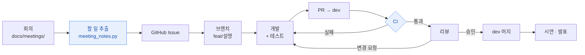
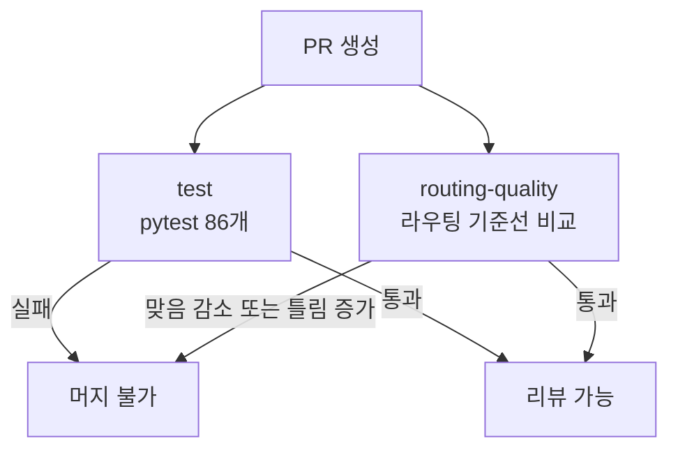

# 팀 작업 흐름

누가, 언제, 어떤 순서로 일을 처리하는지. 그리고 그중 무엇이 이미 자동화돼 있는지.

팀원: 안세호 · 김주형 · 이석우

---

## 1. 개발 파이프라인



파란 칸이 자동화된 단계다. 나머지는 사람이 한다.

지금까지 실제로 이렇게 흘러왔다는 기록이지, 지켜야 할 규칙으로 정한 것은 아니다.

| 단계 | 누가 | 산출물 | 자동화 |
| --- | --- | --- | --- |
| 회의 | 전원 | `docs/meetings/YYYY-MM-DD.md` | — |
| 할 일 추출 | 회의 진행자 | 요약 · 담당자별 할 일 | ✅ `tools/meeting_notes.py` |
| 이슈 등록 | 회의 진행자 | GitHub Issue | 반자동 (확인 후 생성) |
| 개발 | 담당자 | 브랜치 + 테스트 | — |
| PR | 담당자 | PR (base: `dev`) | 템플릿 제공 |
| CI | — | 테스트 · 라우팅 회귀 검사 | ✅ GitHub Actions |
| 리뷰 | 작성자 외 | 승인 또는 변경 요청 | — |
| 머지 | 작성자 | `dev` 반영 | — |

---

## 2. 회의 → 할 일 (AI 자동화)

회의에서 정한 것이 각자의 머릿속에만 남으면, 다음 회의가 "그거 누가 하기로
했었죠?"부터 시작한다. 회의록만 남기면 나머지는 도구가 한다.

```bash
# 1. 회의록을 쓴다 (docs/meetings/TEMPLATE.md 복사)
cp docs/meetings/TEMPLATE.md docs/meetings/2026-09-20.md

# 2. 요약과 담당자별 할 일을 뽑는다
uv run tools/meeting_notes.py docs/meetings/2026-09-20.md

# 3. 이슈로 올릴 명령을 미리 본다
uv run tools/meeting_notes.py docs/meetings/2026-09-20.md --issues

# 4. 확인했으면 실제로 만든다 (한 번 더 묻는다)
uv run tools/meeting_notes.py docs/meetings/2026-09-20.md --create
```

출력은 네 갈래다.

| 항목 | 내용 |
| --- | --- |
| 요약 | 무엇을 다뤘고 무엇이 정해졌는지 3문장 이내 |
| 결정사항 | **확정된 것만** |
| 보류 | 논의했으나 결론이 안 나 다음으로 넘긴 것 |
| 담당자별 할 일 | 담당자 · 완료 조건 · 기한 |

**지어내지 않게 하는 장치가 둘 있다.**

- **구조화 출력** — `response_schema` 로 형태를 고정해 파싱이 결정적이다.
- **담당자 화이트리스트** — 팀원 목록 밖의 사람을 담당자로 적지 못한다. 회의록에서
  누가 맡을지 분명하지 않으면 `미정`으로 둔다. 엉뚱한 사람에게 일이 배정되는 것보다
  비어 있는 편이 낫다.

**`--create` 없이는 리포지토리에 아무것도 만들지 않는다.** 사람이 확인하지 않은 할 일이
이슈 목록에 쌓이면 목록 자체를 아무도 안 보게 된다.

---

## 3. 브랜치와 PR — 지금 이렇게 하고 있다

정해진 규칙이 아니라 **git 기록에서 관찰한 현재 관행**이다. 바꿀지는 팀이 정한다.

| 관찰된 것 | 현황 |
| --- | --- |
| 브랜치 접두사 | `feat/` 와 `feature/` 가 섞여 있다 |
| PR base | 전부 `dev` |
| `main` | `first commit` 하나뿐. `dev` 가 39커밋 앞서 있다 |
| 직접 푸시 | 브랜치 보호가 없어 `dev` 로 바로 푸시되기도 한다 |

### 논의가 필요한 것

정답을 정해 두지 않았다. 회의에서 이야기할 거리다.

- **접두사를 하나로 모을지** — `feat/` 와 `feature/` 중 하나. 섞여 있어도 동작에는
  문제없지만 목록에서 눈에 걸린다.
- **`main` 을 어떻게 할지** — 발표 전에 `dev` 를 한 번 올릴지, 아니면 `dev` 를 기본
  브랜치로 두고 `main` 을 놓아둘지.
- **`dev` 에 브랜치 보호를 걸지** — 걸면 PR·CI·승인을 강제할 수 있지만, 급할 때
  직접 푸시가 막힌다. 3인 팀에 맞는 정도를 정해야 한다.

---

## 4. 이미 자동화된 것

처음 클론한 사람이 손으로 할 일을 줄이려고 만들어 둔 것들이다.

| 도구 | 하는 일 |
| --- | --- |
| `./setup.sh` | 설정 파일 생성, 의존성 설치, **서비스 간 공유 시크릿 맞추기** |
| `./run.sh` | core · 챗봇 · 프론트 한 번에 실행 |
| `.run/*.run.xml` | IntelliJ 실행 구성 (팀 공용, 커밋됨) |
| `.github/workflows/chatbot.yml` | PR 마다 테스트 + 라우팅 품질 회귀 검사 |
| `tools/meeting_notes.py` | 회의록 → 요약 · 담당자별 할 일 |

**`setup.sh` 를 건너뛰면 안 된다.** `JWT_SECRET` 이 서비스마다 다르면 core 가 발급한
토큰을 챗봇이 거부한다. 원본은 Infisical 이고 `setup.sh` 가 내려받아 맞춘다.

**`core (8080)` 실행 구성에는 중복 실행 가드가 들어 있다.** core 를 두 번 띄우면 두 번째
인스턴스가 포트 바인딩에 실패하면서도 종료 훅에서 `create-drop` 의 DROP 을 실행해,
살아 있는 인스턴스의 테이블까지 지운다. 하루에 세 번 겪고 나서 막았다.

---

## 5. CI 가 막아 주는 것



`routing-quality` 는 챗봇 라우팅이 조용히 나빠지는 것을 막는다. 기준선
(`gachisa-chatbot/evals/router_baseline.json`) 과 비교해 **맞음이 줄거나 틀림이 늘면
실패**한다. 의도한 변경이면 기준선을 갱신하고 **그 이유를 PR 에 적는다** — 적지 않으면
기준선이 실패를 따라 내려가기만 해서 아무것도 막지 못한다.

> `routing-quality` 는 리포지토리에 `GEMINI_API_KEY` 시크릿이 있어야 돈다.
> Settings → Secrets and variables → Actions 에서 등록한다. 없으면 건너뛴다.

---

## 6. 무료 API 한도 — 작업 계획에 영향을 준다

Gemini 무료 티어는 **모델마다 따로** 계산된다.

| 모델 | 한도 | 무엇이 쓰나 |
| --- | --- | --- |
| 생성 (`gemini-3.5-flash`) | 하루 20회 · 분당 5회 | 챗봇 대화, 회의록 정리 |
| 임베딩 (`gemini-embedding-001`) | 하루 1000 · 분당 100 | FAQ 색인, 질문 라우팅, 라우터 평가 |

**임베딩 한도는 HTTP 호출이 아니라 문장 수로 센다.** 라우터 평가 한 번이
FAQ 20 + 예시 32 + 질문 50 ≈ 100개를 쓴다. 하루 열 번쯤이 한계다.

**발표 시연은 질문 8개면 생성 한도가 끝난다.** 리허설과 본 발표를 같은 날 하려면
결제 등록을 검토해야 한다.
